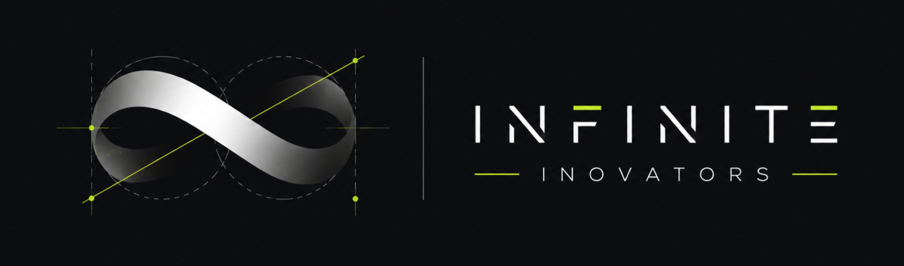
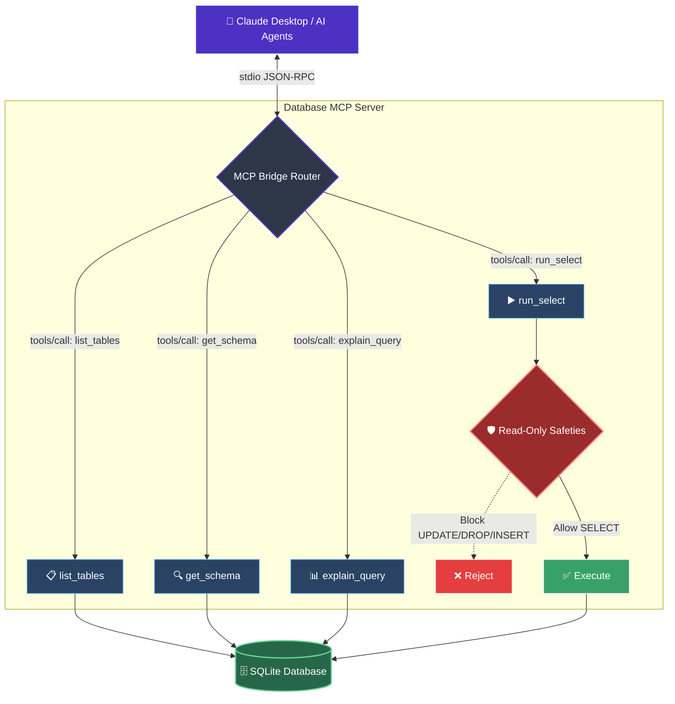

<div align="center">
  
  <br />
  <sub><samp>READ-ONLY SQLITE ACCESS FOR AI AGENTS</samp></sub>
  <h2><samp>DB&nbsp;/&nbsp;BRIDGE</samp></h2>
  
  <p><b>A secure, read-only Model Context Protocol (MCP) server that empowers Claude Desktop and other AI agents to safely query and inspect local SQLite databases.</b></p>

  <p>
    
    
    
    
  </p>
</div>

---

## ✨ Features

- 🛡️ **Read-Only Safeties**: Strict regex filtering intercepts and rejects destructive operations like `INSERT`, `UPDATE`, `DROP`, and `ALTER`. The AI can look, but it can't touch.
- 🔍 **Introspection**: AI can autonomously list tables and read schemas (`PRAGMA table_info`) directly to understand your data structure before writing queries.
- 🚀 **Claude Desktop Ready**: Comes with one-click automated setup scripts for both macOS/Linux and Windows that instantly wire it up to your Claude Desktop config.
- 📊 **Query Analysis**: Includes `explain_query` capabilities to help AI debug complex data retrieval.

---

## Quick Start

The setup scripts create a Python virtual environment, install dependencies, and register `database-mcp` in Claude Desktop.

### Prerequisites

- Python 3.11 or newer
- Git
- Claude Desktop

<br />

### 1. Clone the Repository

```bash
git clone https://github.com/buvaneswaraneb/mcp-database-bridge.git
cd mcp-database-bridge
```

<br />

### 2. Run the Setup Script

Choose the instructions for your operating system.

<details>
<summary><b>macOS / Linux</b></summary>

<br />

Run:

```bash
chmod +x setup.sh
./setup.sh
```

After setup completes:

1. Completely quit Claude Desktop.
   - On macOS, press `Cmd + Q`.
   - On Linux, quit Claude from the application menu.
2. Reopen Claude Desktop.
3. Open a new chat and confirm that `database-mcp` appears in the available tools.

</details>

<br />

<details open>
<summary><b>Windows</b></summary>

<br />

Run `setup.bat` from Command Prompt:

```cmd
setup.bat
```

You can also double-click `setup.bat` from File Explorer.

#### Completely Restart Claude Desktop on Windows

Closing the Claude window may leave it running in the background. Fully stop it before reopening:

1. Press `Ctrl + Shift + Esc` to open **Task Manager**.
2. Select the **Processes** tab.
3. Find **Claude** under **Apps** or **Background processes**.
4. Select each Claude process and click **End task**.
5. Wait a few seconds, then reopen Claude Desktop.

If Claude does not appear under **Processes**, open the **Details** tab and end any `Claude.exe` processes.

</details>

<br />

### 3. Verify the Connection

In Claude Desktop:

1. Open a new chat.
2. Open the tools or integrations menu.
3. Confirm that `database-mcp` is connected.
4. Ask: `What databases are available?`

If the server is not listed, completely stop Claude Desktop again and reopen it.

<br />

---

## 🛠️ Manual Setup (Claude Code / Custom Agents)

If you prefer to configure things manually or use [Claude Code](https://docs.anthropic.com/en/docs/agents-and-tools/claude-code/overview) in your terminal:

1. **Create Virtual Environment & Install Dependencies:**
   ```bash
   python3 -m venv .venv
   source .venv/bin/activate
   pip install -r requirements.txt
   cp .env.example .env
   ```

2. **Add to Claude Code:**
   ```bash
   claude mcp add database-mcp .venv/bin/python src/server.py
   ```

---

## 🧪 Running Tests

Ensure everything is working correctly by running the comprehensive test suite:
```bash
pytest tests/ -v
```

---

## 🏗️ Architecture & Internals



Curious how it works under the hood? 
- Read [docs/structure.md](docs/structure.md) for a detailed walkthrough of the file architecture and the JSON-RPC execution flow.
- Read [docs/ai_usage_note.md](docs/ai_usage_note.md) for notes on how AI was leveraged to build this project.

---
<div align="center">
  <h2>Infinite Inovators</h2>
  <p><sub><samp>PROJECT TEAM</samp></sub></p>
  <p>
    <b>S.B. Jaisree</b><br />
    <b>Buvaneswaran E</b><br />
    <b>P Vishal Kanna</b><br />
    <b>Rithish R</b>
  </p>
  <sub>Built with care for controlled, agent-readable data access.</sub>
</div>
