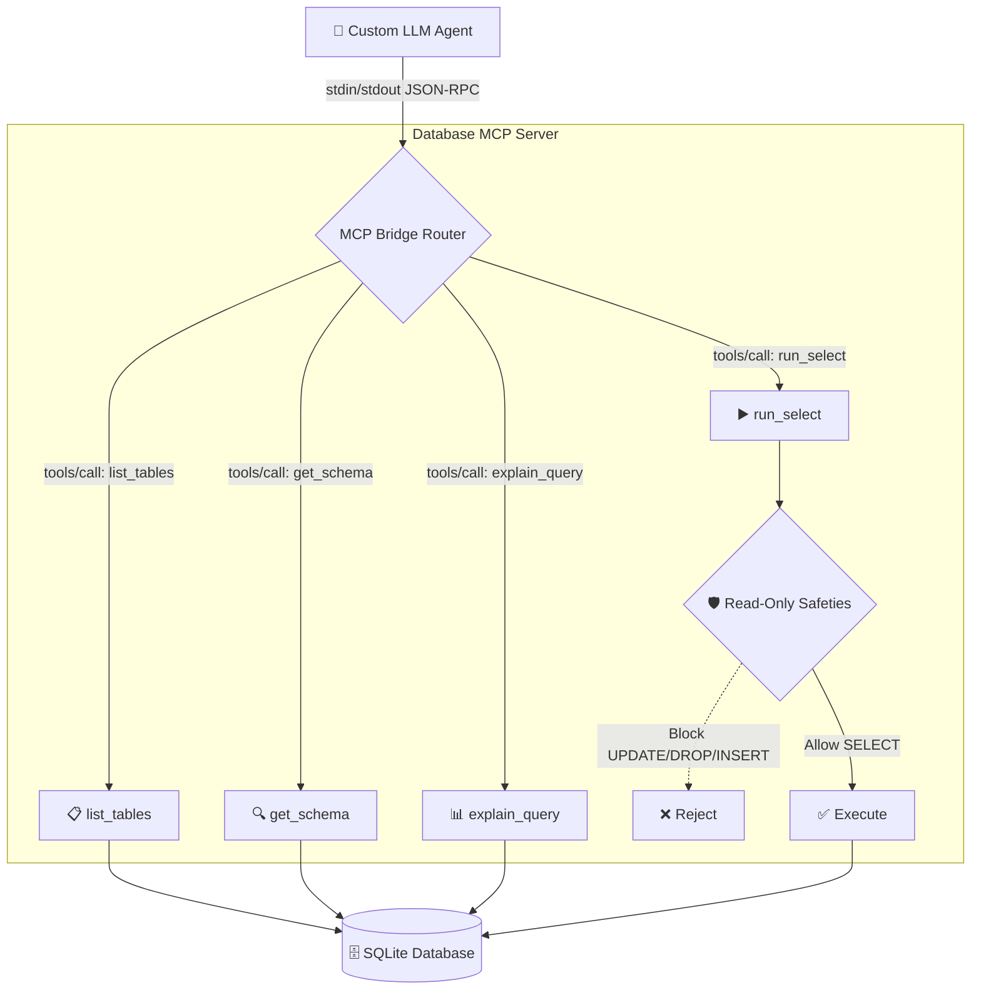

# Custom Agent Integration Guide

---

## Table of Contents
1. [Purpose & Overview](#purpose--overview)
2. [Architecture Diagram](#architecture-diagram)
3. [Prerequisites](#prerequisites)
4. [Setting Up the Custom Agent](#setting-up-the-custom-agent)
5. [Connecting to the MCP Server](#connecting-to-the-mcp-server)
6. [JSON‑RPC Message Flow](#json‑rpc-message-flow)
7. [Example Agent Code (Python)](#example-agent-code-python)
8. [Running the Agent](#running-the-agent)
9. [Extending the Agent with New Tools](#extending-the-agent-with-new-tools)
10. [Security Considerations](#security-considerations)
11. [Troubleshooting & FAQ](#troubleshooting--faq)

---

## Purpose & Overview
The **Custom Agent** is a lightweight Python process that demonstrates how a non‑Claude AI system (e.g., a Groq‑based LLM or an OpenAI model) can consume the same **Model Context Protocol (MCP) server** you built for Claude Desktop. By speaking the identical JSON‑RPC protocol over standard input/output, the custom agent can:
- Discover available database tools (`tools/list`).
- Invoke read‑only queries (`run_select`, `get_schema`, etc.).
- Receive JSON‑encoded results and incorporate them into its own prompt‑generation loop.

This file documents how to set up, connect, and interact with the MCP server from a custom agent, providing concrete code snippets and a full data‑flow diagram.

---

## Architecture Diagram


The custom agent talks directly to the **MCP Bridge Router** via a child process’ `stdin`/`stdout`. The router forwards calls to the SQLite database and returns JSON responses.

---

## Prerequisites
- Python 3.11+ (matching the server version).
- The MCP server repository cloned locally.
- `requirements.txt` installed (includes `groq`, `httpx`, etc. if you plan to use Groq).
- An SQLite database file in `mcp/sample_data/` (or a custom path set via `DB_DIR`/`DB_PATH`).

---

## Setting Up the Custom Agent
1. **Create a virtual environment** (optional but recommended):
   ```bash
   python3 -m venv .agent_venv
   source .agent_venv/bin/activate
   pip install -r requirements.txt   # pulls in groq if needed
   ```
2. **Create the agent script** – for this guide we’ll use `custom_agent.py` placed in the project root.
3. **Configure environment variables** (same as the server):
   ```bash
   export DB_DIR=$(pwd)/mcp/sample_data   # path to your DB folder
   # Optional: specify a single DB file
   # export DB_PATH=$(pwd)/mcp/sample_data/sample.db
   ```

---

## Connecting to the MCP Server
The agent spawns the MCP server as a subprocess and attaches its `stdin` and `stdout` streams. The helper class below abstracts the JSON‑RPC plumbing:

### Example Helper Class (Python)
```python
import json
import subprocess
import threading
import uuid
from typing import Dict, Any

class MCPClient:
    def __init__(self, server_cmd: list):
        # Start the server process (blocking stdio mode)
        self.proc = subprocess.Popen(
            server_cmd,
            stdin=subprocess.PIPE,
            stdout=subprocess.PIPE,
            text=True,
            bufsize=1,
        )
        self._responses: Dict[str, Any] = {}
        self._listener = threading.Thread(target=self._read_stdout, daemon=True)
        self._listener.start()

    def _read_stdout(self):
        for line in self.proc.stdout:
            if not line.strip():
                continue
            try:
                payload = json.loads(line)
                if "id" in payload:
                    self._responses[payload["id"]] = payload
            except json.JSONDecodeError:
                # In production you would log this
                continue

    def _send(self, payload: Dict) -> Dict:
        request_id = payload.get("id") or str(uuid.uuid4())
        payload["id"] = request_id
        self.proc.stdin.write(json.dumps(payload) + "\n")
        self.proc.stdin.flush()
        # Busy‑wait is acceptable for a demo; in a real app use async/event loops
        while request_id not in self._responses:
            pass
        resp = self._responses.pop(request_id)
        return resp

    # Public API wrappers -------------------------------------------------
    def list_tools(self) -> Dict:
        return self._send({"jsonrpc": "2.0", "method": "tools/list"})

    def call_tool(self, name: str, arguments: Dict) -> Dict:
        return self._send({
            "jsonrpc": "2.0",
            "method": "tools/call",
            "params": {"name": name, "arguments": arguments},
        })
```
The `MCPClient` handles spawning the server, sending JSON‑RPC messages, and awaiting a response.

---

## JSON‑RPC Message Flow
1. **Agent → Server** – Sends a JSON‑RPC request on `stdin` (e.g., `tools/call`).
2. **Server** parses, validates, executes the requested tool.
3. **Server → Agent** – Writes a JSON‑RPC response on `stdout` containing either `result` or `error`.
4. **Agent** parses the response, extracts the `content[0].text` field (which is a JSON string), and feeds it back into its LLM prompt template.

---

## Example Agent Code (Python)
Below is a minimal end‑to‑end script that:
- Starts the server.
- Lists available tools.
- Retrieves a list of tables.
- Executes a sample `SELECT`.
- Prints the final, human‑readable answer.
```python
#!/usr/bin/env python3
import json
from pathlib import Path

# Import the MCPClient defined above (or copy‑paste it here)
from mcp_client import MCPClient

# Path to the server entry point – adjust if you moved files
SERVER_CMD = ["python", "-m", "mcp.src.server"]

client = MCPClient(SERVER_CMD)

# 1️⃣ Discover tools (optional, but useful for dynamic agents)
tools_resp = client.list_tools()
print("Available tools:")
for tool in tools_resp["result"]["tools"]:
    print(f"- {tool['name']}: {tool['description']}")

# 2️⃣ List tables in the default DB
tables = client.call_tool("list_tables", {"db_name": None})
print("\nTables:", json.dumps(tables["result"]["content"][0]["text"], indent=2))

# 3️⃣ Run a simple SELECT query
query = "SELECT name, price FROM products LIMIT 3;"
select_resp = client.call_tool("run_select", {"query": query, "db_name": None})
rows_json = select_resp["result"]["content"][0]["text"]
rows = json.loads(rows_json)
print("\nQuery result:", json.dumps(rows, indent=2))

# 4️⃣ Build a natural‑language answer (you could send this back to any LLM)
answer = (
    f"I queried the **products** table and found the following items:\n"
    + "\n".join([f"- {r['name']} – ${r['price']}" for r in rows["rows"]])
)
print("\nGenerated answer for the user:\n", answer)
```
Save this script as `custom_agent.py`, make it executable, and run:
```bash
python custom_agent.py
```
You’ll see the tool list, table names, query results, and a final human‑readable answer printed to the console.

---

## Running the Agent
```bash
# Activate the same venv you used for the server (or share the one env)
source .venv/bin/activate   # if you created one for the repo
python custom_agent.py
```
The agent will automatically launch the MCP server in the background, perform the RPC calls, and shut down when the script exits (the child process inherits the parent’s lifecycle).

---

## Extending the Agent with New Tools
If you add a new tool to `mcp/src/server.py` (e.g., `get_row_by_id`), follow these steps:
1. **Add the function** and entry in the `TOOLS` dict.
2. **Update the JSON‑schema** for its arguments.
3. **Regenerate the client wrapper** (the `MCPClient` does not need changes; you just call `client.call_tool("new_tool", {...})`).
4. **Add unit tests** under `mcp/tests/` to verify the new behavior.

---

## Security Considerations
- The custom agent communicates **locally only** via stdio; never expose the server over a network socket unless you add TLS and authentication.
- The same **read‑only blocklist** and SQLite `?mode=ro` protections apply regardless of the client type.
- Ensure the agent does **not** inadvertently log raw query results containing sensitive data; strip or mask before persisting logs.

---

## Troubleshooting & FAQ
**Q: My agent hangs after sending a request.**
> A: Verify the server is running and that you are writing a newline (`\n`) after each JSON payload. The server reads line‑delimited JSON.

**Q: I see a `Write operation 'INSERT' is not allowed` error.**
> A: The MCP server is deliberately read‑only. Use `run_select` only for SELECT statements.

**Q: Can the custom agent reuse the same server instance for many calls?**
> A: Yes. The `MCPClient` maintains a persistent subprocess, so you can issue unlimited tool calls until you close the client or the process exits.

**Q: How do I change the database location?**
> A: Set `DB_DIR` or `DB_PATH` environment variables before launching the agent (the server reads them on each request).

---

*Document version: 2026‑06‑14*
