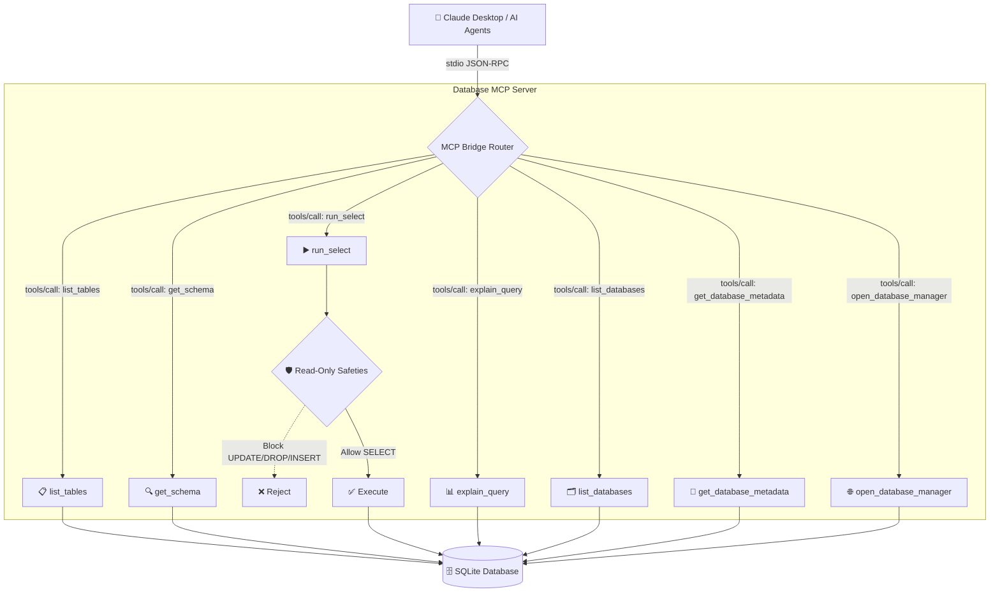

# MCP Server Detailed Documentation

---

## Table of Contents
1. [Overview](#overview)
2. [Architecture Overview](#architecture-overview)
3. [JSON-RPC Communication Protocol](#json-rpc-communication-protocol)
4. [Tool Discovery (`tools/list`)](#tool-discovery-toolslists)
5. [Tool Execution (`tools/call`)](#tool-execution-toolscall)
6. [Security Model & Read‑Only Enforcement](#security-model--read‑only-enforcement)
7. [Data Flow Walkthrough](#data-flow-walkthrough)
8. [Example Interaction Trace](#example-interaction-trace)
9. [Running the Server Locally](#running-the-server-locally)
10. [Extending the Server](#extending-the-server)
11. [Best Practices & Gotchas](#best-practices--gotchas)
12. [FAQ](#faq)

---

## Overview
The **Database MCP Server** implements the **Model Context Protocol (MCP)** standard introduced by Anthropic. It exposes a set of **JSON‑RPC 2.0** tools over a **stdio** channel (standard input / output) that AI agents—such as Claude Desktop, Cursor, or custom agents—can invoke to safely read SQLite databases.

Key goals:
- **Read‑only safety**: No write operations are ever permitted.
- **Schema introspection**: AI can discover tables, columns, and metadata on‑demand.
- **Zero‑latency local execution**: All communication stays on the same machine; no external network traffic.
- **MCP compliance**: The server advertises its capabilities via `tools/list` and follows the exact request/response format prescribed by the MCP spec (v2024‑11‑05).

---

## Architecture Overview


- **MCP Bridge Router** (`handle_request`) is the entry point that parses incoming JSON‑RPC messages and dispatches them to the appropriate tool function.
- Each tool function lives in `mcp/src/server.py` and returns a **plain Python dict** that is later JSON‑encoded and written to `stdout`.
- The **Read‑Only Safeties** layer validates the SQL string before execution and uses SQLite’s `?mode=ro` URI to enforce a read‑only connection at the driver level.

---

## JSON‑RPC Communication Protocol
The server follows the JSON‑RPC 2.0 specification:
- **Request**: `{ "jsonrpc": "2.0", "id": "<unique-id>", "method": "tools/call", "params": { "name": "<tool-name>", "arguments": { … } } }`
- **Response**: `{ "jsonrpc": "2.0", "id": "<same-id>", "result": { "content": [{ "type": "text", "text": "<json‑string>" }] } }`
- **Notifications** (e.g., `ping`, `initialize`) have no `id` and do not require a response.

All messages travel **via stdio**, meaning they are simple text lines written to the child process’ `stdin` and read from its `stdout`. No sockets, HTTP, or external services are involved.

---

## Tool Discovery (`tools/list`)
When an AI client first connects, it typically sends a `tools/list` request:
```json
{
  "jsonrpc": "2.0",
  "method": "tools/list",
  "id": "init_1"
}
```
The server replies with a JSON array describing every callable tool, its human‑readable description, and the JSON‑schema for its arguments. Example entry for `run_select`:
```json
{
  "name": "run_select",
  "description": "Execute a read‑only SELECT query (no writes allowed)",
  "inputSchema": {
    "type": "object",
    "properties": {
      "query": { "type": "string" },
      "db_name": { "type": "string" }
    },
    "required": ["query"]
  }
}
```
The client can then programmatically construct calls that satisfy the schema.

---

## Tool Execution (`tools/call`)
A typical tool call looks like:
```json
{
  "jsonrpc": "2.0",
  "id": "req_42",
  "method": "tools/call",
  "params": {
    "name": "run_select",
    "arguments": {
      "query": "SELECT name, price FROM products LIMIT 5;",
      "db_name": "sample.db"
    }
  }
}
```
The server processes the request as follows:
1. **Dispatch** – `handle_request` matches the `name` to a Python function (`run_select`).
2. **Input Validation** – The function validates the SQL string against a **blocklist** (`INSERT`, `UPDATE`, `DELETE`, etc.) and ensures it starts with `SELECT`.
3. **Read‑Only Connection** – `sqlite3.connect(f"file:{Path(path).resolve()}?mode=ro", uri=True)` forces SQLite into read‑only mode.
4. **Execution** – The query runs, results are limited to 100 rows (`fetchmany(100)`).
5. **Serialization** – Rows are transformed into a list of dictionaries, then JSON‑encoded and wrapped inside the `content` field.
6. **Response** – The JSON‑RPC response is printed to `stdout`.

If validation fails, the server returns an error object, e.g.:
```json
{"error": "Write operation 'INSERT' is not allowed. Only SELECT queries permitted."}
```

---

## Security Model & Read‑Only Enforcement
Two independent layers guarantee safety:
1. **Application‑Layer Regex Blocklist** – Before any SQLite call, the server scans the incoming query for prohibited keywords using a compiled regular expression (`re.search(r"\\bINSERT\\b", query, flags=re.IGNORECASE)`). If a match is found, the request is rejected outright.
2. **Database‑Layer Read‑Only URI** – Even if the blocklist were bypassed, the SQLite driver is invoked with `?mode=ro`. SQLite will refuse any DDL/DML operation, raising an exception that is caught and turned into a JSON error.

Together they provide **defense‑in‑depth**: the first layer stops most malicious inputs early, while the second guarantees immutability at the storage level.

---

## Data Flow Walkthrough
```
Claude Desktop (client)                MCP Server (Python)
-------------------                ------------------------
   1️⃣ JSON request via stdin  →   read line from stdin
   2️⃣ handle_request()        →   parse JSON, route to tool
   3️⃣ tool logic (e.g., run_select) →   open readonly DB, execute
   4️⃣ build dict result        →   json.dumps(result)
   5️⃣ write JSON to stdout    →   flush stdout
   6️⃣ Claude reads stdout      →   parses response, adds to context
```
All steps happen in a **single process**; the only I/O is the text streams.

---

## Example Interaction Trace
Below is a full end‑to‑end transcript (pretty‑printed for readability):

**Step 1 – Tool Discovery**
```json
{ "jsonrpc": "2.0", "id": "discover_1", "method": "tools/list" }
```
Server response (truncated):
```json
{ "jsonrpc": "2.0", "id": "discover_1", "result": { "tools": [ { "name": "list_tables", "description": "List all tables in a specific database", "inputSchema": { "type": "object", "properties": { "db_name": { "type": "string" } }, "required": [] } }, … ] } }
```

**Step 2 – List Tables**
```json
{ "jsonrpc": "2.0", "id": "req_2", "method": "tools/call", "params": { "name": "list_tables", "arguments": { "db_name": "sample.db" } } }
```
Server response:
```json
{ "jsonrpc": "2.0", "id": "req_2", "result": { "content": [ { "type": "text", "text": "{\n  \"tables\": [\"customers\", \"orders\", \"products\"]\n}" } ] } }
```

**Step 3 – Run a SELECT**
```json
{ "jsonrpc": "2.0", "id": "req_3", "method": "tools/call", "params": { "name": "run_select", "arguments": { "query": "SELECT name, price FROM products LIMIT 2;" } } }
```
Server response (showing the JSON‑RPC message lifecycle example already documented in the presentation):
```json
{ "jsonrpc": "2.0", "id": "req_3", "result": { "content": [ { "type": "text", "text": "{\n  \"rows\": [\n    {\"name\": \"Widget A\", \"price\": 29.99},\n    {\"name\": \"Widget B\", \"price\": 49.99}\n  ],\n  \"count\": 2\n}" } ] } }
```
Claude now has the data in its context and can answer the user’s natural‑language question.

---

## Running the Server Locally
1. **Install dependencies** (from repository root):
   ```bash
   python3 -m venv .venv
   source .venv/bin/activate
   pip install -r requirements.txt
   ```
2. **Start the MCP server** (blocking mode, useful for debugging):
   ```bash
   python -m mcp.src.server
   ```
   The process will wait on `stdin`. You can pipe JSON lines into it or let Claude Desktop launch it automatically.
3. **Background mode (used by setup scripts)** – The `open_database_manager` tool spawns a detached `uvicorn` process to serve a web UI, but the core MCP server itself remains a stdio‑only process.

---

## Extending the Server
To add a new tool:
1. **Define the function** in `server.py` following the existing pattern (return a dict, handle errors, keep read‑only guarantees).
2. **Add the entry** to the `TOOLS` dictionary with a description and a JSON‑schema for arguments.
3. **Update documentation** (this file) and optionally the presentation slide deck.

Remember to update the **unit test suite** (`mcp/tests/`) to cover the new tool.

---

## Best Practices & Gotchas
- **Never expose the server over the network** unless you wrap it in a proper authentication layer; the stdio design is intentionally local‑only.
- **Keep the blocklist up‑to‑date** – future SQLite extensions could introduce new write‑capable statements.
- **Limit result size** – the server caps `fetchmany(100)`. Adjust only after careful assessment of token budget.
- **Use absolute paths** for `DB_DIR` and `DB_PATH` to avoid accidental directory traversal.
- **Graceful shutdown** – pressing `Ctrl‑C` sends a SIGINT; the server will exit cleanly after finishing any in‑flight request.

---

## FAQ
**Q: Can I query multiple databases in one request?**
> A: No. Each tool call is scoped to a single database (`db_name` argument). If you need to join data across DBs, you must copy the relevant tables into a temporary read‑only database first.

**Q: How does error handling work?**
> A: Any exception inside a tool is caught and returned as `{ "error": "<message>" }` inside the `result.content` array. Claude displays the error text to the user.

**Q: Does the server cache schema information?**
> A: No. For simplicity and freshness, each call re‑inspects the SQLite schema. If performance becomes a concern, you can implement an in‑memory cache respecting the read‑only guarantee.

---

*Document version: 2026‑06‑14*
