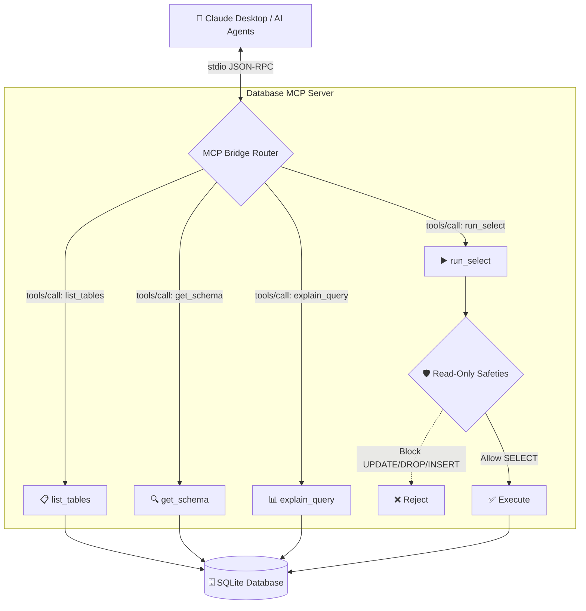

# Build a Database MCP Server
**A Secure, Read-Only Database Bridge for AI Agents**

---

## Title & Project Overview
**Project Title:** Build a Database MCP Server
**Business Problem:** LLMs can't safely query DBs without re-implementing client code.
**Expected POC Output:** Build an MCP server exposing list_tables, get_schema, run_select (read-only), explain_query. Demonstrate use from Claude Desktop + a custom agent.
**AI / Agent Capability Required:** MCP server authoring + safe SQL execution.

---

## Team Introduction
**Team Name:** Infinite Inovators
**Members:**
- Buvaneswaran E
- P Vishal Kanna
- S.B. Jaisree
- Rithish R

*Built with care for controlled, agent-readable data access.*

---

## Executive Summary
Integrating Large Language Models (LLMs) with real-world databases unlocks immense potential for automated data analysis. However, granting AI direct database access introduces severe security risks. DB/BRIDGE solves this by providing a standardized Model Context Protocol (MCP) server that enforces strict read-only execution, allows autonomous schema introspection, and seamlessly integrates with Claude Desktop and custom agents.

---

## Problem Statement
AI agents need access to structural and tabular data to answer complex user queries. The traditional approach requires humans to manually write queries, export CSVs, and feed them to the LLM. 
Giving an LLM direct SQL execution capabilities is dangerous:
- **Destructive Actions:** Hallucinations or prompt injections could lead to `DROP TABLE`, `DELETE`, or `UPDATE` commands.
- **Data Overload:** Fetching massive datasets can exceed the LLM's context window.
- **Lack of Context:** LLMs don't natively know the database schema, leading to invalid queries.

---

## Introduction to Model Context Protocol (MCP)
The Model Context Protocol (MCP) is an open standard introduced by Anthropic. It standardizes how AI models connect to external data sources. Instead of writing custom API integrations for every AI agent, MCP provides a unified JSON-RPC protocol over standard input/output (stdio) or HTTP, allowing LLMs to discover and interact with local tools safely.

---

## Challenges of Database Access for LLMs
1. **Security:** Preventing unauthorized data modification or deletion.
2. **Schema Discovery:** How does the LLM know what tables and columns exist before writing a query?
3. **Query Errors:** LLMs often write dialect-incorrect SQL or make invalid table joins.
4. **Context Limits:** Returning 1 million rows to an LLM will crash the context window and result in massive token costs.

---

## Proposed Solution
**DB/BRIDGE** intercepts database requests from the AI through the MCP protocol. 
- It provides a suite of discovery tools (listing tables, inspecting schemas) so the AI can learn the structure.
- It enforces a strict read-only environment using regex blocklists and SQLite's read-only mode (`?mode=ro`).
- It limits query results (e.g., max 100 rows) to protect context windows.

---

## Primary Use Cases
- **Business Intelligence (BI) Assistants:** Empowering business users to ask natural language questions (e.g., "What was Q3 revenue?") directly to an AI that queries the DB autonomously.
- **Data Analysts & Developer Support:** Helping junior data analysts or developers quickly explore database schemas, understand relationships, and generate complex SQL without manual typing.
- **Customer Support Agents:** Allowing an AI to safely look up order statuses, tracking info, or customer profiles from a read-only replica without any risk of database corruption.
- **Automated Reporting:** Creating background AI workflows that run on a schedule to fetch the latest data and generate daily analytical summaries.

---

## System Architecture



---

## Data Transfer Mechanism: Server ↔ Claude
**How does data actually move between the LLM and the Database?**
1. **Communication Channel:** Communication happens completely locally over standard input/output (stdio) streams using the JSON-RPC 2.0 protocol defined by the MCP standard. No data is sent to external, third-party middleware APIs.
2. **Tool Discovery (`tools/list`):** Upon connection, Claude Desktop sends a request to the server. The server responds with a JSON array describing its capabilities (e.g., `run_select`, `get_schema`) and the expected arguments.
3. **Tool Execution (`tools/call`):** When Claude needs data, it sends a structured JSON request (e.g., `{"method": "tools/call", "params": {"name": "run_select", "arguments": {"query": "SELECT * FROM users"}}}`).
4. **Data Return:** The Python server executes the query, converts the SQL rows into a JSON array, and prints it out. Claude reads this JSON, parses the data, and incorporates it into its context to answer the user's prompt.

---

## JSON-RPC Message Lifecycle Example
This is exactly how Claude and the MCP server communicate behind the scenes:

**1. Claude sends a tool call request (JSON via `stdin`):**
```json
{
  "jsonrpc": "2.0",
  "id": "req_123",
  "method": "tools/call",
  "params": {
    "name": "run_select",
    "arguments": {
      "query": "SELECT name, price FROM products LIMIT 2;"
    }
  }
}
```

**2. The MCP Server executes the query and sends the response back (JSON via `stdout`):**
```json
{
  "jsonrpc": "2.0",
  "id": "req_123",
  "result": {
    "content": [
      {
        "type": "text",
        "text": "{\n  \"rows\": [\n    {\"name\": \"Widget A\", \"price\": 29.99},\n    {\"name\": \"Widget B\", \"price\": 49.99}\n  ],\n  \"count\": 2\n}"
      }
    ]
  }
}
```
**3. Claude processes the response:** Claude reads the text content from the JSON response, interprets the data, and generates a natural language reply for the user.

---

## Database MCP Server Design
The server is built in Python (3.11+) and interfaces seamlessly with SQLite. It communicates via JSON-RPC over stdio, adhering to the MCP specification version `2024-11-05`. The design prioritizes modularity, providing specific discrete tools for schema inspection rather than a single monolithic "query" tool.

---

## Core MCP Tools Overview
The server exposes several highly specific tools to the LLM:
1. `open_database_manager`
2. `list_databases`
3. `get_database_metadata`
4. `list_tables`
5. `get_schema`
6. `run_select`
7. `explain_query`

---

## Tool Implementation: list_tables()
**Description:** Lists all available tables within a specific database.
**Implementation Details:**
- Connects to the SQLite database.
- Executes `SELECT name FROM sqlite_master WHERE type='table' ORDER BY name`.
- Returns a clean JSON array of table names.
- Essential for the AI to begin its exploration of an unknown database.

---

## Tool Implementation: get_schema()
**Description:** Retrieves the column names, data types, and constraints for a given table.
**Implementation Details:**
- Validates the table name using strict regex (`[A-Za-z_][A-Za-z0-9_]*`) to prevent injection.
- Executes `PRAGMA table_info([table_name])`.
- Returns structured JSON defining each column's name, type, and whether it is nullable.

---

## Tool Implementation: run_select()
**Description:** Executes a read-only SQL query and returns the results.
**Implementation Details:**
- **Validation:** Enforces that the query strictly begins with `SELECT`.
- **Blocklist:** Rejects queries containing `INSERT`, `UPDATE`, `DELETE`, `DROP`, `CREATE`, `ALTER`, `TRUNCATE`, or `PRAGMA`.
- **Context Protection:** Appends or enforces a `fetchmany(100)` limit so the AI is never flooded with millions of rows.

---

## Tool Implementation: explain_query()
**Description:** Returns the query execution plan.
**Implementation Details:**
- Pre-checks the query with the exact same safety blocklist as `run_select`.
- Prefixes the AI's query with `EXPLAIN QUERY PLAN`.
- Helps the LLM debug slow or syntactically ambiguous queries autonomously.

---

## Tool Implementation: list_databases() & get_database_metadata()
**Description:** Discovery tools for the physical database files.
**Implementation Details:**
- `list_databases()`: Scans the configured directory for `.db` and `.sqlite` files.
- `get_database_metadata()`: Returns file sizes, SQLite version, and iterates through tables to run a `COUNT(*)` to give the AI an idea of data volume.

---

## Tool Implementation: open_database_manager()
**Description:** Starts and opens a local web UI.
**Implementation Details:**
- Spawns a background `uvicorn` process for a FastAPI/web UI.
- Opens the user's default browser to `http://127.0.0.1:8000`.
- Allows humans to easily upload/manage databases that the AI can then see.

---

## Security Architecture & Read-Only Enforcement
Security is enforced in two layers:
1. **Application Layer (Regex Blocklist):** The Python code intercepts the string query. If words like `DROP` or `DELETE` are found, it instantly rejects the tool call without ever touching the database driver.
2. **Database Layer (Connection String):** The SQLite connection string explicitly uses the URI parameter `?mode=ro` (read-only mode). Even if a malicious query bypassed the regex, SQLite itself will refuse to modify the file.

---

## Claude Desktop Integration
The project features automated setup scripts (`setup.sh` for macOS/Linux, `setup.bat` for Windows). 
These scripts:
- Create an isolated Python virtual environment.
- Install dependencies.
- Automatically modify the `claude_desktop_config.json` file to register `database-mcp` with the correct executable path.
- Enables zero-configuration setup for end users.

---

## Custom Agent Integration
Beyond Claude Desktop, DB/BRIDGE provides a custom ChatGPT-inspired web client. 
- Built with a FastAPI backend and a web frontend.
- Uses Groq API (`llama-3.3-70b-versatile`) to act as the AI agent.
- Can be run locally or deployed to Vercel, allowing custom AI agents to leverage the exact same MCP tools to answer human questions.

---

## End-to-End Workflow Demonstration
1. **User asks:** "Who are our top customers?"
2. **AI checks DB:** Calls `list_tables()`. Sees `customers` and `orders`.
3. **AI checks Schema:** Calls `get_schema('customers')` and `get_schema('orders')` to find primary and foreign keys.
4. **AI queries Data:** Calls `run_select("SELECT c.name, SUM(o.amount) FROM customers c JOIN orders o ON c.id = o.customer_id GROUP BY c.id ORDER BY SUM(o.amount) DESC LIMIT 5")`.
5. **AI responds:** Formats the returned JSON into a natural language response for the user.

---

## Traditional Database Querying vs MCP-Based Querying
| Traditional | MCP-Based |
| :--- | :--- |
| Requires human SQL knowledge | AI writes SQL autonomously |
| Static CSV exports | Dynamic, real-time exploration |
| High risk if giving direct access to AI | Safely sandboxed and strictly read-only |
| Human must explain schema to AI | AI introspects schema automatically |

---

## Performance & Productivity Analysis
- **Zero Hallucination Retrieval:** Because the AI relies on actual SQL execution, mathematical sums and counts are performed by the SQL engine natively, not guessed by the LLM.
- **Time Saved:** Eliminates the back-and-forth context switching between DBeaver/DataGrip and ChatGPT.
- **Rapid Iteration:** If a query fails, the AI reads the SQLite error natively and instantly corrects its own syntax.

---

## Efficiency Metrics and Evaluation
- **Token Efficiency:** By requesting schema only when needed, we save thousands of tokens compared to pasting entire database dumps into the prompt.
- **Speed:** Local SQLite execution combined with `stdio` JSON-RPC has near-zero latency, taking milliseconds per tool call.
- **Safety Hit Rate:** 100% block rate on destructive commands via `mode=ro`.

---

## Benefits and Business Impact
- **Democratized Data Access:** Non-technical stakeholders can "talk" to their data without a data engineer.
- **Secure Enterprise AI:** Provides a framework for companies to safely experiment with AI without risking their operational databases.
- **Extensible Standard:** Because it uses MCP, this single server works immediately with Claude Desktop, Cursor, and custom enterprise agents without code changes.

---

## Project Results and Key Achievements
- Delivered a fully functional, standard-compliant MCP server.
- Built automated installation routines across all major operating systems.
- Created an interactive web client utilizing Groq LLMs.
- Successfully implemented airtight read-only constraints.

---

## Future Enhancements
- Expand database support to include PostgreSQL, MySQL, and SQL Server.
- Implement fine-grained access control (e.g., hiding specific columns like `passwords` or `ssn` from the AI).
- Add Vector search capabilities to allow semantic querying within the SQL database.
- Add query timeout constraints to prevent the AI from writing locking `CROSS JOIN` loops.

---

## Conclusion
DB/BRIDGE demonstrates the power of the Model Context Protocol. By providing a secure, introspective, read-only interface, we have successfully bridged the gap between Large Language Models and relational databases. This project ensures that AI can be both incredibly insightful and absolutely safe.

---

## Questions & Answers

*(Open floor for questions)*
